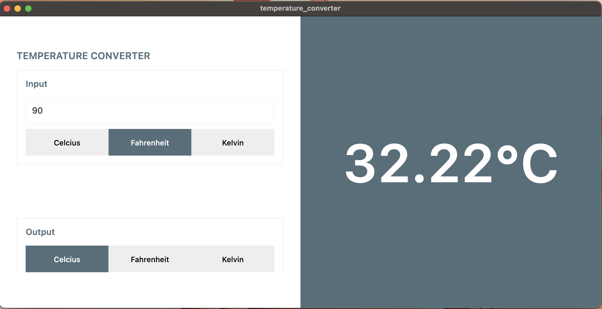

# Temperature Converter GUI

A temperature converter Desktop App built with Rust + Flutter. It converts between Celcius, Fahrenheit and Kelvin temperature scales.

A [Standalone CLI version](https://github.com/faetysal/temperature_converter_cli) exists written in Rust.